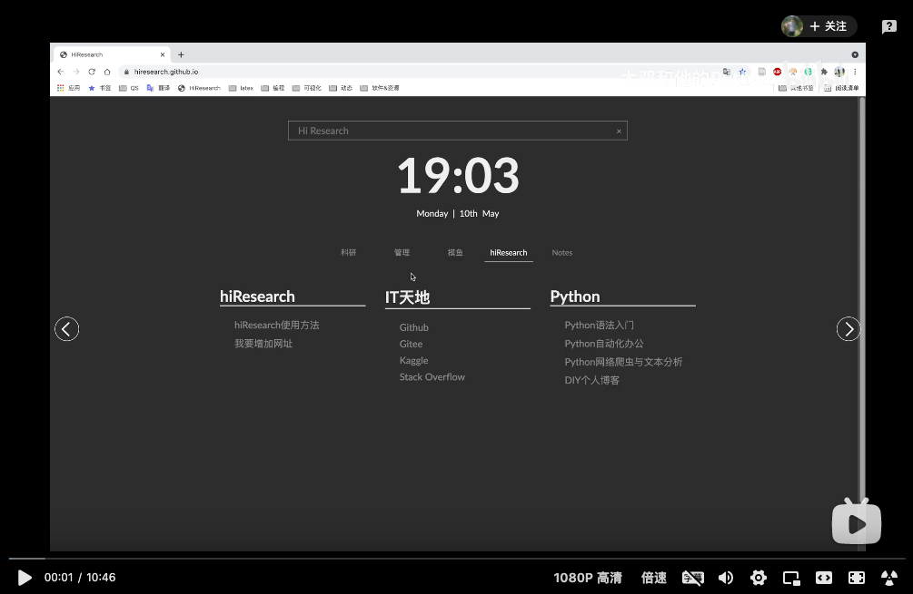
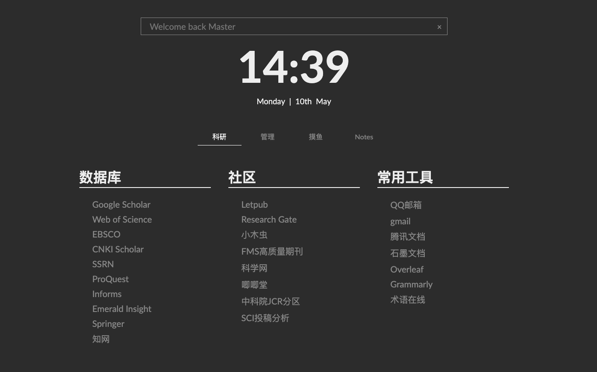
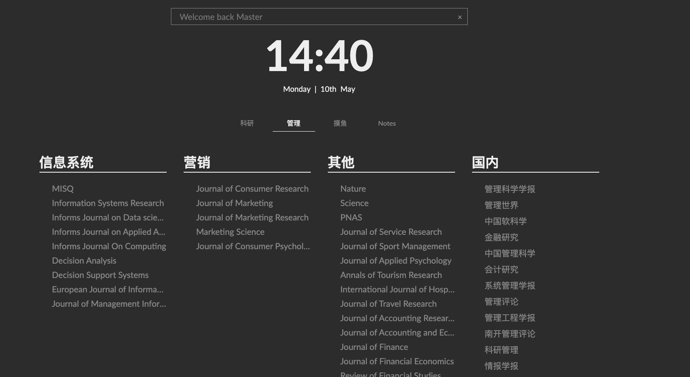
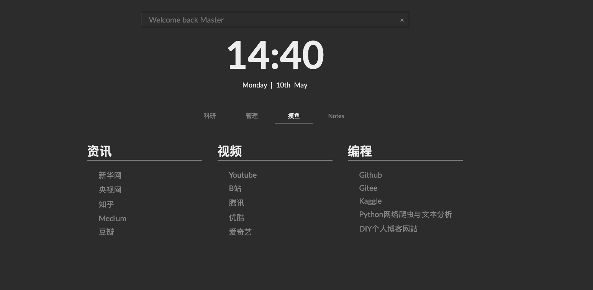
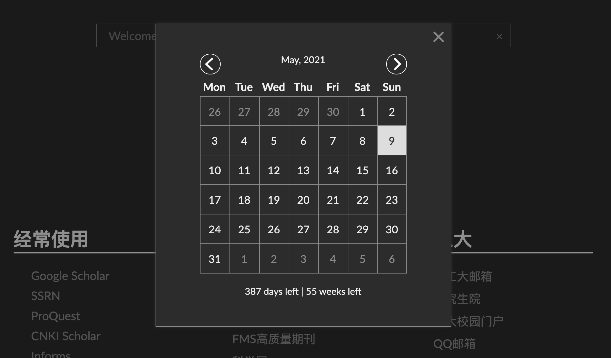
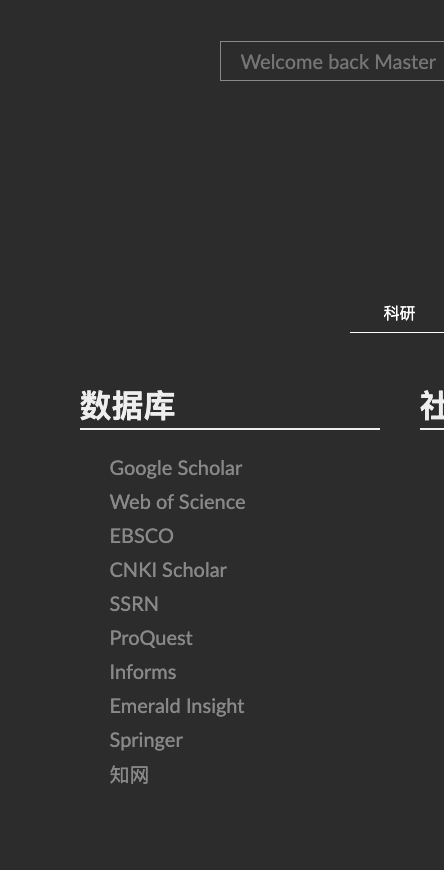

# Hi Research

参考[GreatDanton](https://github.com/GreatDanton) 项目，丢弃庞杂丑陋的浏览器收藏夹， 打造简洁科研浏览器首页。

每个人都可以自定义自己的浏览器首页，替换默认浏览器首页/起始页。 该项目可在任何现代浏览器上运行，只需将index.html设置为主页并添加自己的链接
到index.html

<br>


# 演示
- [**点击链接查看效果 https://hiresearch.github.io/**](https://hiresearch.github.io/)
- 也可点击下方B站视频查看操作讲解

[](https://www.bilibili.com/video/BV1eK4y197x9/)

<br>


# 一、功能

* 搜索(google)
* 日历(倒计时)
* 待办事项
* 支持DIY自己的首页


<br>


# 二、截图

各位可根据自身科研或者工作需要，更改成自己的标签名，替换为自己需要的网站网址








日历, 在index.html中可以设置自己认为最最重要的日子

```
<script>
	// 显示日期时钟
	showClock();

	//在日历上显示倒计时
	countDown({"y": 2022,
           	"m": 6,
           	"d": 1
           	}, "Message when your countdown ends");
</script>
```




待办事项


<br>


# 三、添加链接
网站链接需要直接加到index.html的 ``<div class="slides-container"``标签内，以学术生活如下


```html
<div class="slide" name="科研">
    <div class="part">
        <h1> 数据库 </h1>
        <div class="links">
            <a href='https://scholar.google.com/'>Google Scholar</a>
            <a href='https://webofknowledge.com/'> Web of Science </a>
            <a href='https://search.ebscohost.com/'> EBSCO </a>
	    <a href='https://scholar.cnki.net/'> CNKI Scholar </a>
            <a href='https://www.ssrn.com/index.cfm/en/'>SSRN</a>
            <a href='https://www.proquest.com/site/pqdd_unavailable.shtml'> ProQuest </a>
            <a href='https://pubsonline.informs.org/'> Informs </a>
            <a href='https://www.emerald.com/insight/'> Emerald Insight </a>
            <a href='https://link.springer.com/'> Springer </a>
            <a href='http://www.cnki.net/'> 知网 </a>
      </div>
   </div>
</div>
```





# 四、使用方法
* 点击时钟，弹出日期框和倒计时信息。
* 搜索框支持`!command`搜索语法. 例如

    | 搜索框命令 | 目标网站 | 例子 | 作用 |
    | -------- | --------- | -------   | -------- |
    | !scholar | google scholar | !scholar python | 在谷歌学术中搜**python**相关信息 |
    | !book   | 豆瓣读书 | !book python | 在豆瓣读书中搜**python**相关书籍信息 |
    | !movie | 豆瓣电影 | !movie 悬崖之上 | 在豆瓣电影中搜**悬崖之上**相关电影信息 |
    | !zhihu  | 知乎 | !zhihu python | 在知乎网站搜python相关信息 |
    | !youtube | youtube | !youtube python | 在youtube搜索python相关视频 |
    | !taobao | 淘宝 | !taobao python | 在淘宝搜python相关商品服务 |
    | !jd | 京东 | !jd python | 在京东搜python相关商品服务 |
    | !bilibili | B站 | !bilibili python | 在B站搜索python相关视频 |
    | !github | github | !github python | 在github上搜python相关仓库代码等信息 |
    | !mail | qq邮箱 | !mail | 默认打开qq邮箱 |


<br>

# 五、项目代码结构
```
├── components
│   ├── calendar.js
│   ├── clock.js
│   ├── countdown.js
│   ├── notes.js
│   ├── search-box.js
│   └── slides.js
├── css
│   ├── main_min.css
│   └── main.scss
├── index.html 
```

* Components文件夹: 含有浏览器主页所需的所有组件js文件。
    * `calendar.js` -> 日历
    * `clock.js` -> 时钟
    * `countdown.js` -> 倒计时
    * `notes.js` ->待办事项todo list
    * `search-box.js` -> 主页搜索框
    * `slides.js` -> 页面滑动功能
* `index.html` -> 浏览器主页入口


<br>


# 如果

如果您是经管人文社科专业背景，编程小白，面临海量文本数据采集和处理分析艰巨任务，个人建议学习[《python网络爬虫与文本数据分析》](https://ke.qq.com/course/482241?tuin=163164df)视频课。作为文科生，一样也是从两眼一抹黑开始，这门课程是用五年时间凝缩出来的。自认为讲的很通俗易懂o(*￣︶￣*)o，

- python入门
- 网络爬虫
- 数据读取
- 文本分析入门
- 机器学习与文本分析
- 文本分析在经管研究中的应用

感兴趣的童鞋不妨 戳一下[《python网络爬虫与文本数据分析》](https://ke.qq.com/course/482241?tuin=163164df)进来看看~


<br>


# 更多

- [B站:大邓和他的python](https://space.bilibili.com/122592901/channel/detail?cid=66008)

- 公众号：大邓和他的python

- [知乎专栏：数据科学家](https://www.zhihu.com/people/hidadeng)


